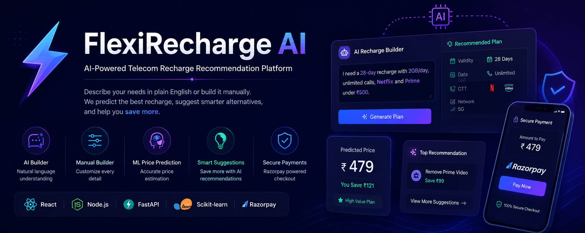
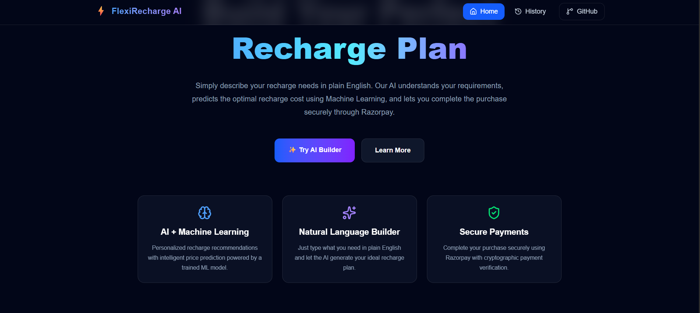
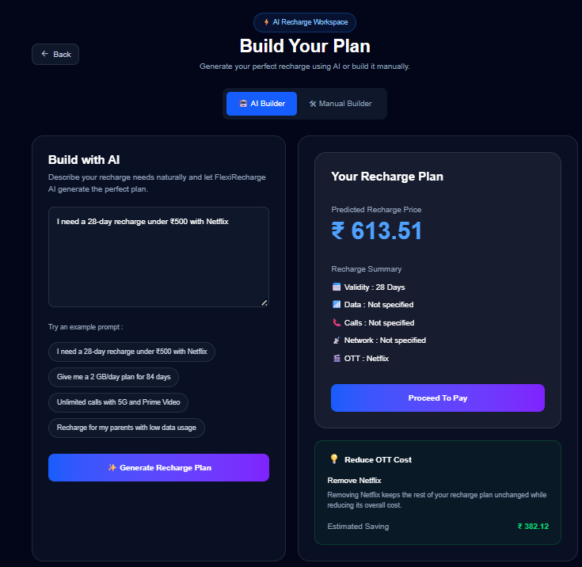
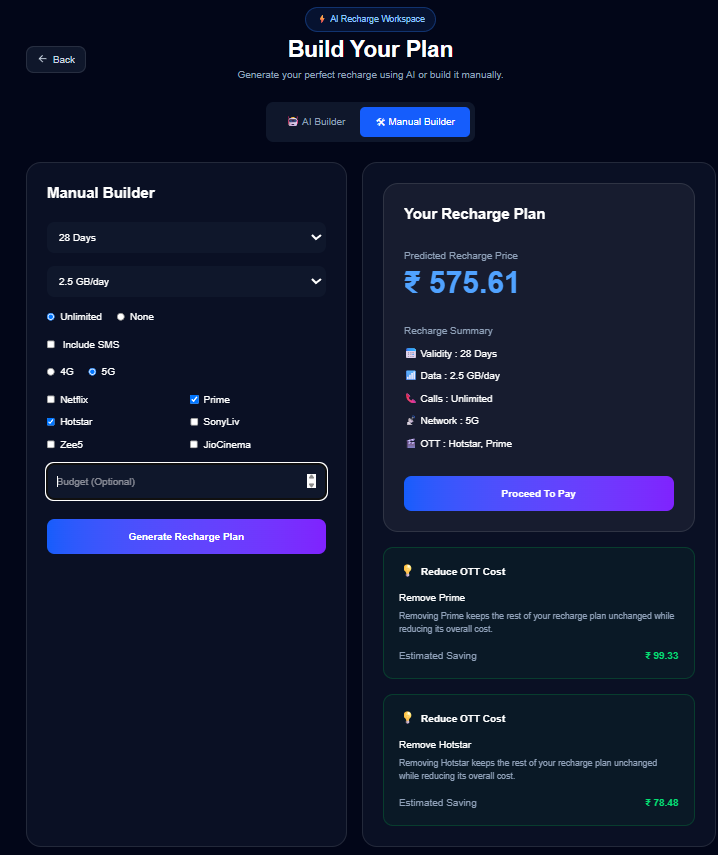
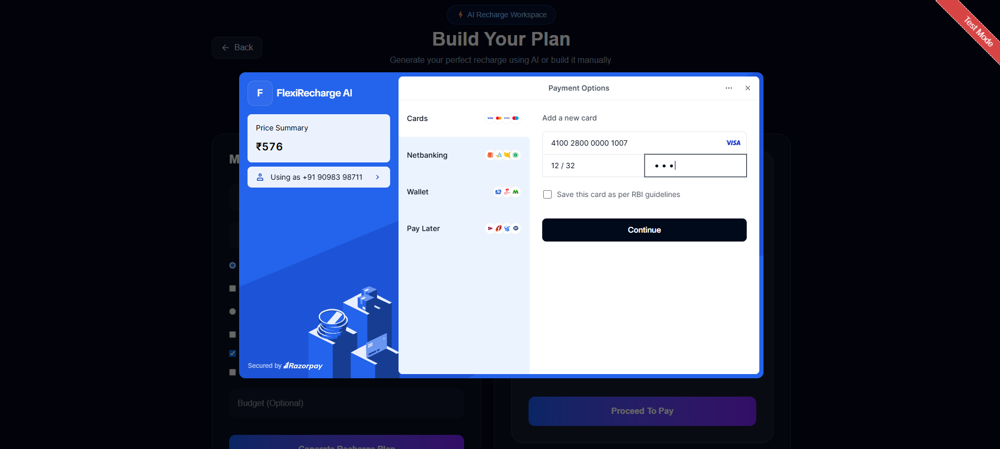
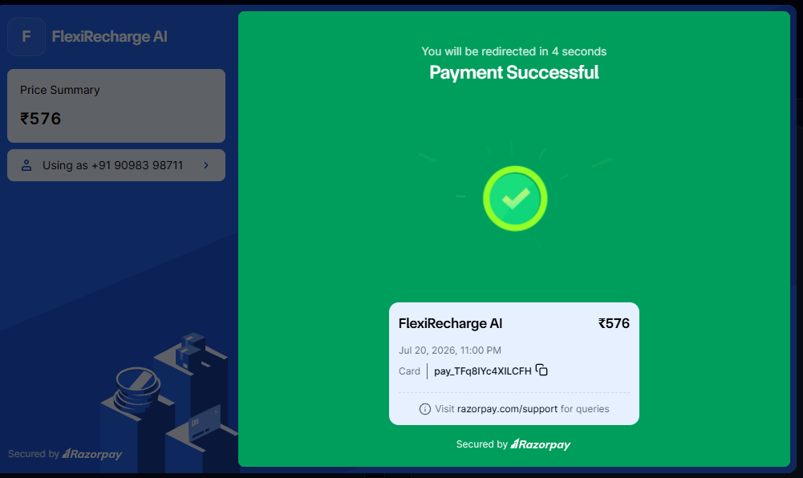
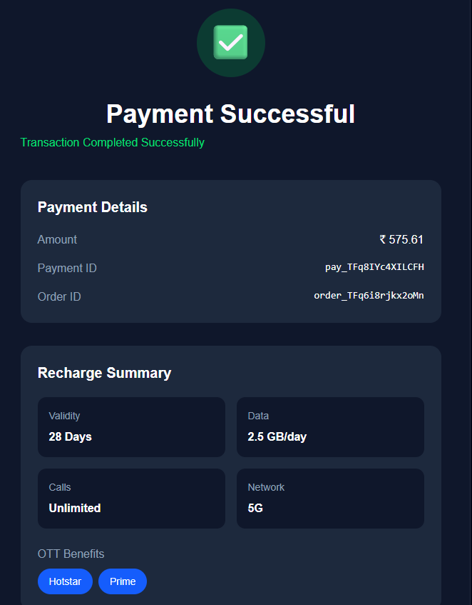

<div align="center">

<h1>⚡ FlexiRecharge AI</h1>

<h3>
AI-Powered Telecom Recharge Recommendation Platform
</h3>

Generate personalized recharge plans using **Natural Language Processing**, **Machine Learning**, and **Secure Razorpay Payments**.

<br/>


<br/>

<!-- Replace after deployment -->

### 🌐 Live Demo 

</div>

---


<p align="center">
  
</p>
<p align="center">
  
</p>


---

# 🚀 Overview

FlexiRecharge AI is an intelligent recharge recommendation platform that enables users to create personalized telecom recharge plans using either natural language or a manual builder.

Instead of browsing dozens of recharge packs, users simply describe what they need.

The platform then:

- Understands the user's requirements using Natural Language Processing
- Predicts recharge pricing using Machine Learning
- Suggests cost-saving alternatives
- Completes secure payments through Razorpay

---

# ✨ Features

## 🤖 AI Recharge Builder

Generate recharge plans using plain English.

Example:

> "I need a 28-day recharge with 2GB/day, Netflix and unlimited calls under ₹500."

---

## ⚙️ Manual Recharge Builder

Customize every part of your recharge.

- Validity
- Daily Data
- Calls
- SMS
- Network
- OTT Platforms
- Budget

---

## 🧠 Machine Learning Price Prediction

Predict recharge prices using a trained **Random Forest Regression** model.

---

## 💡 Smart Recommendation Engine

Generate intelligent cost-saving recommendations including:

- OTT Optimization
- Network Optimization
- Validity Optimization

---

## 💳 Secure Payments

Integrated with Razorpay.

Features include:

- Order Creation
- Secure Checkout
- Signature Verification

---

## 🎨 Modern User Experience

- Responsive UI
- Dark Theme
- Loading States
- Success Page
- Toast Notifications

---

# 🏗️ System Architecture

```text
                   React + Tailwind CSS
                           │
                           ▼
                    Express Backend
                           │
          ┌────────────────┴────────────────┐
          ▼                                 ▼
   FastAPI ML Service                 Razorpay API
          │
          ▼
      NLP Parser
          │
          ▼
   Feature Engineering
          │
          ▼
 Random Forest Regressor
          │
          ▼
 Recommendation Engine
```

---

# 🧠 Machine Learning Pipeline

```text
User Prompt

↓

Natural Language Parser

↓

Structured Recharge Plan

↓

Feature Engineering

↓

Random Forest Model

↓

Predicted Price

↓

Counterfactual Recommendation Engine

↓

Recharge Recommendation
```

---

# 🛠️ Tech Stack

### Frontend

- React
- Vite
- Tailwind CSS
- Axios
- React Router
- React Hot Toast

### Backend

- Node.js
- Express.js
- Razorpay SDK

### Machine Learning

- FastAPI
- Scikit-learn
- Pandas
- NumPy
- Joblib

### Database (Upcoming)

- Supabase

---

# 📂 Project Structure

```text
FlexiRecharge AI

│

├── client/
│     ├── src/
│     └── public/
│
├── server/
│     ├── controllers/
│     ├── routes/
│     ├── services/
│     └── config/
│
├── ml-service/
│     ├── counterfactual/
│     ├── models/
│     ├── training/
│     └── dataset/
│
└── README.md
```

---

# 📸 Screenshots

## 🏠 Landing Page

> 

---

## 🤖 AI Builder

> 

---

## ⚙️ Manual Builder

> 

---

## 💳 Razorpay Checkout

> 

---

## ✅ Payment Success

> 

---

## ✅ Recharge Success Page

> 

---

# ⚙️ Installation

## Clone Repository

```bash
git clone https://github.com/shivi028/FlexiRecharge-AI.git
```

---

## Frontend

```bash
cd client

npm install

npm run dev
```

---

## Backend

```bash
cd server

npm install

npm run dev
```

---

## ML Service

```bash
cd ml-service

pip install -r requirements.txt

uvicorn main:app --reload
```

---

# 🔑 Environment Variables

## Client

```env
VITE_API_URL=

VITE_RAZORPAY_KEY_ID=
```

---

## Server

```env
ML_API_URL=

RAZORPAY_KEY_ID=

RAZORPAY_KEY_SECRET=
```

---

## ML Service

```env
MODEL_PATH=
```

---

# 🚀 Future Scope

- User Authentication
- Recharge History
- PDF Receipt Download
- Admin Dashboard
- Operator Dataset Integration
- LLM-based Recharge Explanation
- Personalized Recharge Analytics

---

# 👨‍💻 Author

### Shivi Tiwari

Master of Technology (Information Technology)

International Institute of Professional Studies (IIPS), DAVV

- GitHub: https://github.com/shivi028
- LinkedIn: https://www.linkedin.com/in/shivi-tiwari/

---

<div align="center">

### ⭐ If you found this project useful, consider giving it a star.

Made with ❤️ using React, FastAPI, Machine Learning & Razorpay.

</div>[]